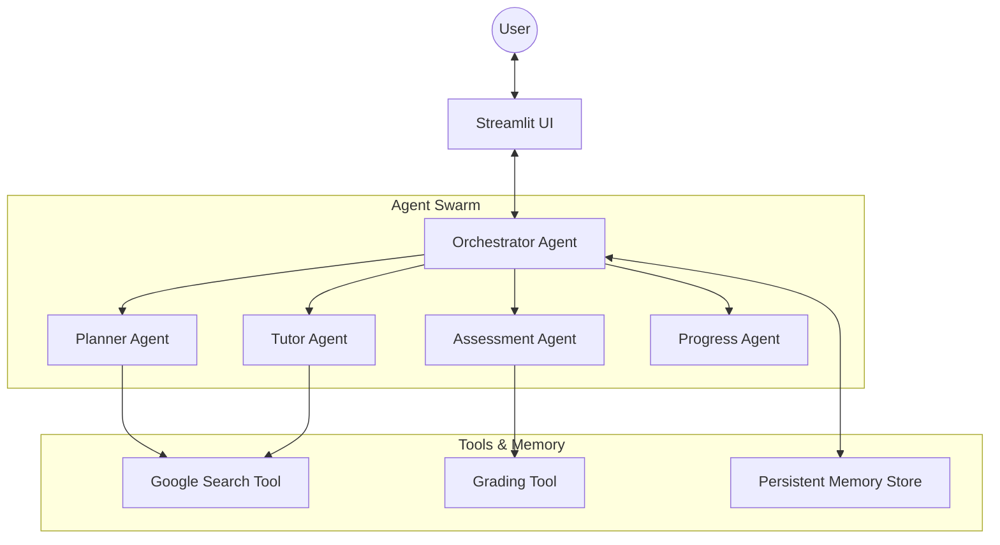

# 🎓 Personalized Learning Coach

> **Your AI-powered mentor for mastering any subject.**
> *Agents Intensive Capstone Project - Education Track*


## 💡 The Pitch

### The Problem
Self-learning is hard. Online courses are rigid, one-size-fits-all, and lack the personalized feedback of a real tutor. Learners often get stuck, lose motivation, or waste time on concepts they already know.

### The Solution
The **Personalized Learning Coach** is an AI-driven system that creates dynamic, adaptive learning paths for *any* topic. It doesn't just dump content; it acts as a **Multi-Agent System** that:
1.  **Plans** a custom curriculum based on your goals.
2.  **Teaches** lessons using Socratic methods.
3.  **Assesses** your understanding with generated quizzes.
4.  **Adapts** the schedule based on your performance.

### The Value
- **Save Time:** No more searching for "what to learn next."
- **Deep Understanding:** Interactive dialogue ensures you actually *get it*.
- **Motivation:** Progress tracking and adaptive feedback keep you engaged.

---

## 🏗️ Architecture

This project uses a **Multi-Agent System** architecture powered by Google Gemini.



### Key Agents
- **Orchestrator:** The "brain" that manages state, routes user intent, and coordinates other agents.
- **Planner:** Generates structured weekly learning paths (Topics, Objectives).
- **Tutor:** Delivers content, explains concepts, and answers questions.
- **Assessment:** Generates quizzes and evaluates user answers.

---

## ✨ Key Features (Hackathon Criteria)

This project demonstrates the following advanced agentic concepts:

### 1. Multi-Agent System (MAS)
We use a specialized swarm of agents. The **Orchestrator** dynamically delegates tasks. For example, when a user asks for a "new plan," the Orchestrator calls the **Planner Agent**. When the user says "quiz me," it activates the **Assessment Agent**.

### 2. Long-Term Memory & State Management
The system persists:
- **Learning Plans:** Your curriculum and progress are saved.
- **Chat History:** Context is preserved per-week, so the agent remembers what you discussed in Week 1 even when you are in Week 3.
- **Assessment Results:** Weak areas are tracked to recommend reviews.

### 3. Tool Use (Gemini & Custom)
- **Google Search:** Agents can look up the latest information to ensure lessons are up-to-date.
- **Custom Grading Tool:** A deterministic tool to grade multiple-choice questions accurately.

---

## 🚀 Setup & Deployment

### Prerequisites
- Docker (Recommended)
- OR Python 3.10+
- Google Gemini API Key

### Option 1: Docker (Easiest)
1.  Clone the repository.
2.  Create a `.env` file with your API key:
    ```bash
    GOOGLE_API_KEY=your_api_key_here
    ```
3.  Run with Docker Compose:
    ```bash
    docker-compose up --build
    ```
4.  Open `http://localhost:8501` in your browser.

### Option 2: Local Python
1.  Install dependencies:
    ```bash
    pip install -r requirements.txt
    ```
2.  Set environment variable:
    ```bash
    export GOOGLE_API_KEY=your_api_key_here
    ```
3.  Run the app:
    ```bash
    streamlit run app.py
    ```

### Deployment (Cloud Run)
This project is containerized and ready for Google Cloud Run.
1.  Build the image: `gcloud builds submit --tag gcr.io/PROJECT-ID/learning-coach`
2.  Deploy: `gcloud run deploy learning-coach --image gcr.io/PROJECT-ID/learning-coach --platform managed`

---

## 🧪 Testing
Run the test suite to verify agent behavior:
```bash
pytest tests/
```

## 📜 License
MIT License. Built for the Google AI Agents Intensive Hackathon 2025.
